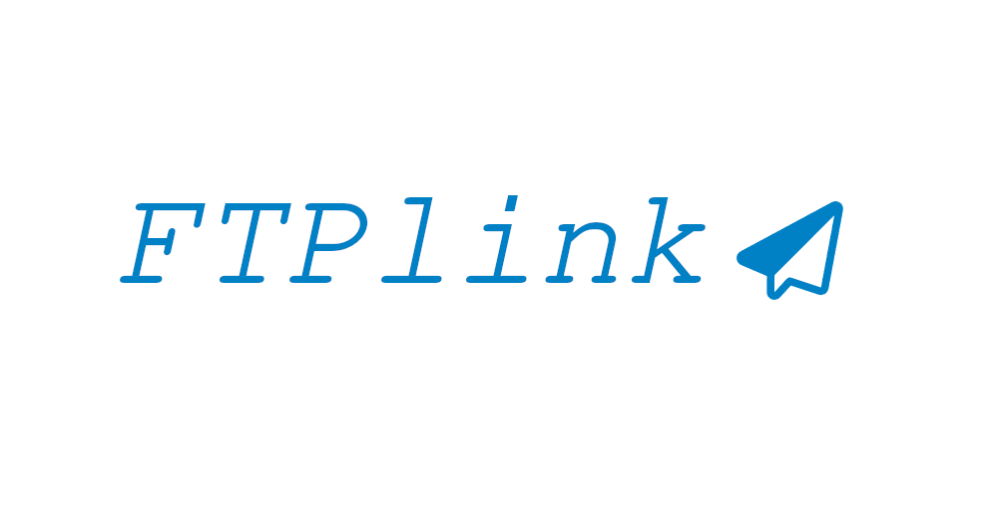

> **AI disclosure:** Parts of this project (code, tests, CI/CD automation and
> documentation) were created or assisted by AI tools. All changes are gated by
> automated tests and a human is expected to review anything that fails.

# Origin
Imagine you have multiple surveillance cameras and want to know when something is moving or happening. 
The cameras only offer builtin push notification for an app you dont want to use and the only other options are smtp and ftp uploads.
All the cameras are connected via a raspberry to the internet. Your prefered way of notification is telegram (a chat app on the smartphone that supports bots).

# What ftplink does
- setup a ftp server in python
- upload of any picture/video will be forward to a specific telegram group using a bot token


## local docker example:
```
docker run -it --rm -e bot_token="xxx:xxx" -e group_chat_id="-123" -p21:2121 -p60000-60010:60000-60010 ftp
``` 

## docker-compose example:
```
version: '3'

services:
  pyftp:
    image: tomfankhaenel/ftplink:latest
    restart: always
    environment:
      - bot_token=xxx:xxx
      - group_chat_id=-123
    ports:
      - "21:2121"
      - "60000-60010:60000-60010"
    volumes:
      - ftp:/app/ftp
volumes:
  ftp:
```

# Automation

This repository is fully automated:

- **Dependency updates** are opened by Renovate as Conventional-Commit pull requests.
- **CI** (`.github/workflows/ci.yml`) runs the functional test suite (`src/test_ftp_server.py`) and a multi-arch Docker build on every PR.
- **Auto-merge**: Renovate merges an update only when *all* CI checks are green. If a test breaks, the PR is left open and labelled for a human to review — it is never merged.
- **Daily release** (`.github/workflows/release.yml`): once a day, if anything was merged since the last tag, a new release is created. The version is bumped major/minor/patch based on the merged commit messages, which then builds and pushes the image.

Required repository secrets: `DOCKERHUB_USERNAME`, `DOCKERHUB_TOKEN`.
